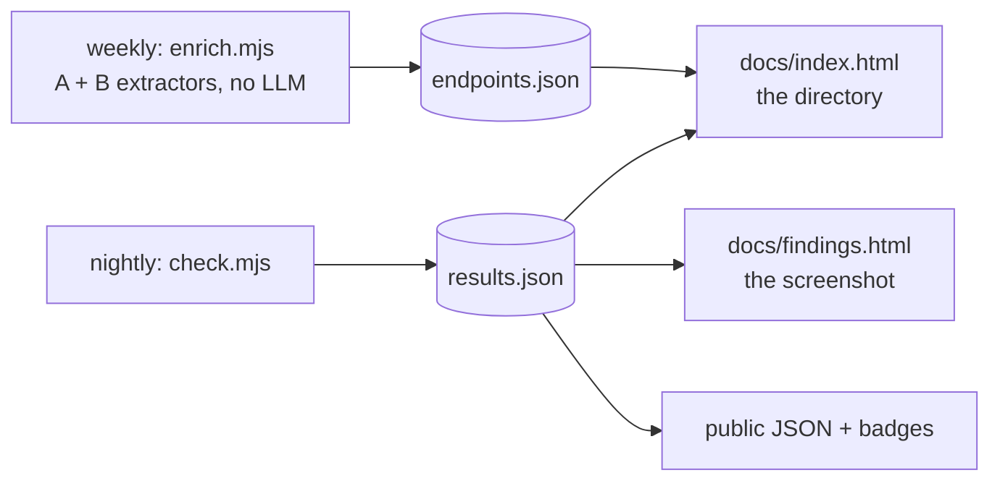

# API Graveyard → Directory

Reframe from "uptime monitor for a README" to **the place to find a public API
that actually works**. No PR bot, no LLM extractor.

## Why

The upstream README is 1757 flat links whose CORS column is self-reported and
**wrong 25% of the time** where we have measured it. We already collect what it
does not:

| We measure | Upstream publishes |
|:---|:---|
| Live status, 3-strike confirmed | nothing |
| Real CORS (`Origin` sent, header read) | a self-reported guess |
| Real latency | nothing |
| Where dead links now redirect | nothing |

That answers a question developers actually have and nothing else answers:
*"I need a no-auth, CORS-enabled, currently-alive API for X that I can call
from a static page."*

## What changes

Nothing about the nightly job. This is a reframing of the **output**, plus
wiring up the v2 modules that already exist and pass their tests.

## 1. The filter that matters

One chip row, above the existing table:

> **Works right now** · **No auth** · **CORS verified**

Applying all three leaves the set of APIs someone can actually call from a
static page today. That is the product; everything else on the page is
supporting material.

- `alive` or `blocked` counts as working — a bot wall on the docs page says
  nothing about the API.
- **CORS verified** means measured by us, not copied from upstream. Entries
  without a confirmed endpoint say "unverified", never "no".
- Sort by measured latency when the filter is on.

**Recall honesty:** v2 confirms endpoints for ~24% of no-auth entries (~200).
The page must never imply the other 76% failed a test — they were never
testable. Three states, worded plainly: `verified` / `unverified` / `no`.

## 2. Findings page — the part that gets linked

A second static page off the same `results.json`. Numbers we already have:

- **Rot by category.** Cryptocurrency 40% broken (34/85), Machine Learning
  39%, URL Shorteners 38%.
- **128 entries silently redirect to a different host** — the link works, the
  destination is not what the README claims.
- **CORS self-reporting is wrong 25% of the time** in the sample we verified.
- **65 domains no longer resolve at all.**

One chart per finding, honest sample sizes on every number.

## 3. Public JSON + badges

`results.json` is already published as static JSON on Pages. Document it as an
endpoint and add a shields.io-compatible route so any project can show a live
status badge in its own README.

- `results.json` — everything, already live
- `badge/<slug>.json` — shields.io endpoint schema, generated in the same run
- CORS header so the data is usable from a browser

Costs nothing: static files on Pages, written by the job that already runs.

## Phases

| Phase | Work | Done when |
|:---|:---|:---|
| 1 | Wire `enrich.mjs` — extractors A and B over the 849 no-auth entries, cache to `endpoints.json`, weekly | ~200 verified endpoints on disk |
| 2 | The three-chip filter + verified CORS/latency columns | Filter combination returns a usable list |
| 3 | `findings.html` with the four findings above | Renders from `results.json` alone |
| 4 | Badge route + documented JSON endpoint | A badge renders in a README |

Phases 1 and 2 are the product. 3 and 4 are why anyone hears about it.

## Non-goals

- **The upstream PR bot.** Out, permanently.
- **Extractor C (LLM).** Measured: it cannot reach the 40% gate either, so it
  buys complexity and spend for a few percent. Dropped, not deferred.
- Accounts, submissions, or anything with a database.
- Re-testing entries that need an API key — still impossible without keys.

## Risks

| Risk | Mitigation |
|:---|:---|
| "Verified" reads as a quality claim we cannot support at 24% | Three explicit states; `unverified` never renders as a failure |
| The directory framing invites feature creep toward a real product | Phases 1-2 only; no database, no accounts, no submissions |
| Findings page numbers go stale as the data moves | Generated from `results.json` at build time, never hand-written |
| Badges imply an SLA we do not offer | Badge reflects last nightly run, with the timestamp in the JSON |
