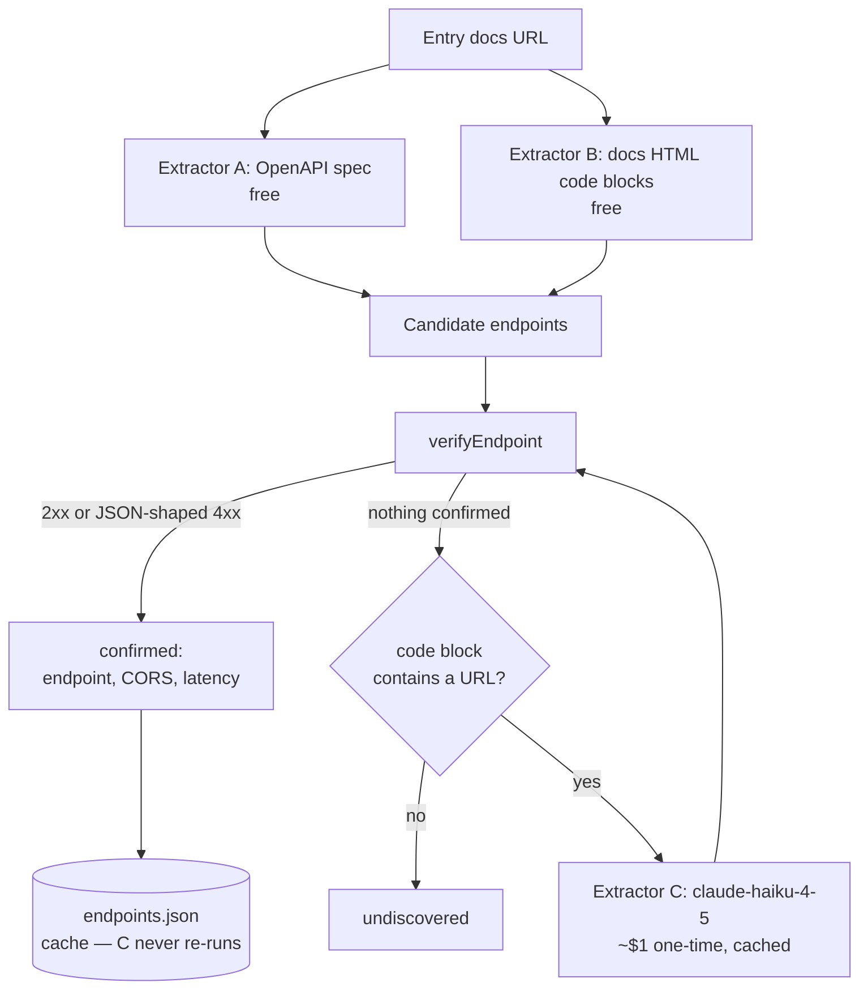

# API Graveyard — v2 Plan: Real Endpoint Verification

Excludes the upstream PR bot. v1 (link health) is live and unaffected by
anything here.

## Why the first attempt failed

`scripts/discover.mjs` is written, tested (26 tests, 100% line coverage) and
**finds nothing**: measured recall on 50 real no-auth entries was **1/50 = 2%**.

The specification was wrong, not the code. URL-shape heuristics guess
`example.com/api` and `api.example.com`, but real endpoints live at documented
paths with required parameters:

| Entry | What the heuristic guessed | Where the API actually is |
|:---|:---|:---|
| Crafatar | `crafatar.com/api` -> 404 | `/avatars/<uuid>` |
| geoPlugin | `api.geoplugin.com/` -> 400 | `/json.gp?ip=<addr>` |
| Puyo Nexus | `github.com/api` -> 404 | entry points at a repo, not an API |

**The endpoint is written down in the docs.** So read the docs, do not guess.

## The one number that decides this

Nothing gets built past Phase 0 until extraction recall is measured on a
50-entry sample.

| Measured recall | Decision |
|:---|:---|
| **>= 40%** | Build Phases 1-3 |
| **15-39%** | One iteration on the extractors, re-measure once, then decide |
| **< 15%** | **Drop v2.** Delete `discover.mjs`, keep v1, move on |

This gate exists because the last approach reached 26 green tests before anyone
asked whether it worked. Measure first this time.

## Three extractors

Ordered by cost. The two free ones run first; the model only ever sees what
they could not resolve.

| | Extractor | Cost | Runs on |
|:---|:---|:---|:---|
| A | OpenAPI / Swagger spec | free | every entry |
| B | Docs HTML code blocks | free | every entry |
| C | `claude-haiku-4-5` extraction | ~$1 one-time, $0/week | only A+B misses that contain a URL |

### A. OpenAPI / Swagger spec — authoritative, not a guess

Probe a handful of conventional spec locations (`/openapi.json`,
`/swagger.json`, `/v3/api-docs`, plus any `<link>`/`<script>` in the docs page
pointing at one). A spec that parses gives `servers[].url` joined with
`paths`, and states which parameters are required — so candidates come with
the knowledge of whether they can be called bare.

Highest-value extractor: when it hits, the result is fact rather than
inference.

### B. Code blocks in the docs page

Fetch the docs HTML and pull absolute URLs out of `<pre>` and `<code>` — the
curl example is where the endpoint is literally written down.

Ranking, best first:
1. Host matches the entry's registrable domain, or is `api.<that domain>`
2. Appears inside `<pre>`/`<code>` rather than prose
3. Contains no unresolved placeholder (`{id}`, `:id`, `YOUR_KEY`, `<token>`)
4. Appears more than once across the page

Discard: asset URLs (`.png`, `.css`, `.js`), social/repo links, and anything
on an unrelated host. Cap at 6 candidates per entry, as today.

### C. LLM fallback — only on what A and B miss

Extraction is exactly what a small model is good at: "here are the code blocks
from a docs page, return the callable endpoint URL or null."

Order matters for cost. A and B are free, so they run first and C only sees
the leftovers. Sending all 849 pages to a model would be paying to solve
problems a regex already solved.

**Model: `claude-haiku-4-5`** — $1 / $5 per MTok in/out, 200K context.
Cheapest current Claude model and the right tier for extraction; reasoning
models are wasted here. (Those are Anthropic first-party rates — OpenRouter
adds its own margin and its prices move, so confirm on their models page.)

**This is a one-time cost, not a recurring one.** A confirmed endpoint is
cached in `endpoints.json`; the weekly job re-verifies it with one plain HTTP
request and costs nothing. The model only ever sees an entry once — plus the
handful of new entries upstream adds each week, which is cents per month.

Four things keep the one-time number small:

1. **Free extractors run first.** A and B cost nothing, so C only sees their
   misses.
2. **Prefilter on "is there even a URL here".** If a docs page has no absolute
   URL in any code block, the model cannot invent one. Skipping those is free
   and removes a large slice of the remaining entries.
3. **Send the code blocks, trimmed to ~2.5K tokens** — the blocks that contain
   a URL, not the whole page. A full docs page is 50K+ tokens of nav and CSS.
   Cheaper *and* more accurate.
4. **Cache in `endpoints.json`**, so nothing is ever extracted twice.

| | |
|:---|---:|
| ~300 entries reach C after the free extractors and the prefilter | |
| Input: trimmed code blocks, ~2.5K tokens each | ~0.75M -> ~$0.75 |
| Output: one JSON object, ~200 tokens | ~0.06M -> ~$0.30 |
| **One-time total** | **~$1** |
| Ongoing, per week | **~$0** |

Halve the one-time figure again with the Batch API (50% off) if the calls go
to Anthropic directly rather than through OpenRouter.

Phase 0 measures A and B alone first. C is only worth wiring up if A and B
leave a large enough gap to be worth a dollar — if they already clear 40%,
the dollar is worth spending on the remaining 60%; if they land at 5%, the
docs pages are not parseable and C probably will not rescue it either.

## Scraping stack: no new dependency

[Scrapling](https://github.com/d4vinci/scrapling) is a capable Python framework
— stealth fetching, Cloudflare Turnstile bypass, TLS fingerprint spoofing, full
JS rendering via Playwright. Three reasons it is the wrong fit here:

1. **It solves a problem we have not measured yet.** Extractor B needs the text
   of `<pre>`/`<code>` from static HTML. That is a fetch and a regex. Adding
   Python 3.10, Playwright and browser downloads to a zero-dependency Node
   project — one whose nightly CI currently installs nothing — is a large,
   permanent weight for a need Phase 0 has not yet demonstrated.

2. **The stealth half actively contradicts what this project sells.** v1's
   credibility rests on reporting `blocked` (76 entries) honestly as a bot
   wall rather than a death. Using Turnstile bypass and fingerprint spoofing to
   get behind those walls turns a measurement project into an evasion project,
   against the very hosts whose availability we publish. It is also the kind of
   thing that gets a repo reported, and it would undermine the upstream PR work
   this all eventually feeds.

3. **We already own the JS-rendering trick, for free.** `scripts/test_page.mjs`
   drives headless Chrome with `--dump-dom`, and GitHub's `ubuntu-latest` image
   ships Chrome. If a docs page turns out to need rendering, that is a handful
   of lines against a binary already present — no new dependency, no stealth.

**The better answer to JS-rendered docs is Extractor A, not a browser.** Swagger
UI, Redoc and GitBook render client-side precisely because they fetch a spec
file. Grabbing that `openapi.json` over plain HTTP is cheaper than rendering the
page *and* returns authoritative data instead of scraped text.

**Revisit if:** Phase 0 shows a large share of misses are JS-rendered *and*
Extractor A does not catch them. The fix then is `--dump-dom`, still not
stealth.

## Fix carried over from the failed attempt

`verifyEndpoint` currently requires `res.ok && json`. **A JSON-shaped 4xx is
evidence of a live API**, not a disqualification — `api.geoplugin.com/` returns
400 with a JSON body because it is a real endpoint rejecting a malformed
request. Accept 2xx, plus 4xx with a JSON body, as confirmation. 5xx and HTML
stay negative.

No test covers this today, because the tests were written against the same
wrong assumption as the code. It gets one, test-first.

## Phases

| Phase | Work | Gate |
|:---|:---|:---|
| **0** | Extractors A and B only, throwaway quality. Measure recall on 50 entries | **The table above.** Stop here if it fails |
| **0b** | LLM fallback (C) on the Phase 0 misses, same 50 entries | Does combined recall clear 40%? |
| 1 | Harden the extractors, test-first, with fixture HTML and fixture specs | 80%+ coverage |
| 2 | `scripts/enrich.mjs` — run discovery across the 849 no-auth entries, cache results in `endpoints.json` | Weekly, not nightly |
| 3 | Surface it: endpoint URL, **verified** CORS, p50 latency on the page | Page test extended |

## Budget

Discovery is far heavier than v1's one-request-per-entry: up to 4 spec probes,
1 docs fetch and 6 candidate calls per entry.

- **Weekly, not nightly.** v1 stays nightly and untouched.
- **Cache in `endpoints.json`.** An entry with a confirmed endpoint is not
  re-discovered; it is just re-verified, at one request.
- Only the 849 no-auth entries. Anything needing a key cannot be verified
  without one and is out of scope permanently.

**Model spend (Extractor C):** ~$1 one-time for the whole corpus, then ~$0 a
week. The weekly job re-verifies cached endpoints over plain HTTP and never
calls a model; only entries new to upstream reach C after the first pass. A
hard per-run call cap fails the job loudly rather than quietly running up a
bill if that assumption ever breaks.

## What gets published

Two columns nobody else publishes, on entries where an endpoint was confirmed:

- **Verified CORS** — measured by sending an `Origin` and reading
  `access-control-allow-origin` back, versus upstream's self-reported column.
  The disagreement rate between the two is itself the interesting number.
- **p50 latency** of the actual API, not of its documentation site.

Entries with a confirmed endpoint get a "verified" badge; everything else keeps
showing v1 link health exactly as now. **v2 never downgrades a v1 status** —
failing to find an endpoint says nothing about whether the API is alive.

## Risks

| Risk | Mitigation |
|:---|:---|
| Docs are a JS-rendered SPA, so raw HTML has no code blocks | Extractor A often still works — Swagger UI and Redoc both load a spec file |
| Extraction finds a URL that needs auth or params we cannot supply | JSON-shaped 4xx counts as confirmation, which is exactly this case |
| Probing hundreds of third-party hosts weekly reads as abuse | Weekly cadence, cache hits skip discovery, 6-candidate cap, real User-Agent |
| Recall is mediocre and the temptation is to ship it anyway | The Phase 0 gate is a number agreed in advance, not a judgement call after |
| Model spend creeps past the one-time estimate | C runs only on cache misses, behind a URL prefilter, under a hard per-run call cap that fails the job rather than spending |
| The model invents a plausible endpoint that does not exist | Nothing C returns is trusted — every candidate still goes through `verifyEndpoint`, so a hallucinated URL fails like any other bad guess |

## Non-goals

- The upstream PR bot (excluded from this plan by request)
- Anything touching the 753 `apiKey` / 140 `OAuth` entries
- Response schema or content validation — confirming JSON is the bar
- Sending every entry to a model when a regex would do
- Changing v1's status taxonomy or its nightly job
