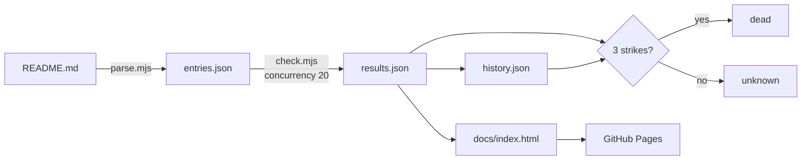

# API Graveyard — v1 Plan

Uptime and truth data for the 1,758 entries in
[public-apis/public-apis](https://github.com/public-apis/public-apis).

## Goal

Publish a searchable, trustworthy answer to "is this API still alive?" for every
entry in the most-starred API list on GitHub — and contribute the confirmed-dead
findings back upstream as PRs.

## What the data actually looks like

Measured from the live README, not assumed:

| Fact | Value |
|:---|:---|
| Entry rows (`NF==7` markdown table rows) | 1,758 |
| Categories (`###` sections) | 52 |
| Entries needing no auth | 849 |
| Entries needing `apiKey` | 753 |
| Entries needing `OAuth` | 140 |

**The constraint that shapes everything:** the listed URLs are documentation or
homepage links, not API endpoints.

```
| [Cats](https://docs.thecatapi.com/) | Pictures of cats | `apiKey` | Yes | No |
| [Dog Facts](https://kinduff.github.io/dog-api/) | Random facts | No | Yes | Yes |
```

Pinging those tells you whether the docs site is up — not whether the API works.
v1 owns that limitation openly and measures link health. v2 earns the right to
say "the API works" by discovering real endpoints.

## v1 scope — link health

### Status taxonomy

Five states, never two. Most link checkers collapse to alive/dead and are wrong
often enough that nobody trusts them.

| Status | Meaning |
|:---|:---|
| `alive` | 2xx |
| `moved` | 3xx to a different host — entry is stale even though nothing is down |
| `blocked` | 403/429/bot-wall. **Not dead.** Cloudflare guarding a live API looks identical to death to a naive checker |
| `dead` | DNS failure, connection refused, 404, sustained 5xx |
| `unknown` | Timeout, or first time seen |

### Pipeline



### Files

Four, plus the workflow. Node 22, built-in `fetch`, **zero dependencies**.

| Path | Job |
|:---|:---|
| `scripts/parse.mjs` | README.md -> entries.json (name, url, desc, auth, https, cors, category) |
| `scripts/check.mjs` | entries.json -> results.json, merged into history.json |
| `docs/index.html` | One static page: search, filter by status/category/auth |
| `.github/workflows/check.yml` | Nightly cron + `workflow_dispatch`, commits results, deploys Pages |

No server, no database, no hosting bill.

### The one piece of real engineering

**A single timeout is not death.** Promote to `dead` only after 3 consecutive
failed runs; decay straight back to `alive` on any success. Without this, the
first flaky night publishes a wall of false positives and the project loses the
only thing it is selling — trustworthiness.

This is the part that gets a test.

### Budget

1,758 probes, concurrency 20, 10s timeout, HEAD with GET fallback: **~3 minutes
per run**. Free on a public repo. Nightly.

## Verification

One `test_history.mjs` covering the strike logic:

- fail, fail -> still `unknown`
- fail, fail, fail -> `dead`
- fail, fail, success -> `alive`, strike count reset
- `blocked` never counts as a strike

Plus a smoke run of `parse.mjs` asserting it finds 1,700+ entries across 50+
categories — a README format change upstream should break the build loudly, not
silently publish an empty graveyard.

## Non-goals for v1

- Endpoint discovery and real API calls (that is v2)
- The upstream PR bot (needs 30 days of history before a removal is defensible)
- Charts, sparklines, deadness-by-category analysis
- Any framework, bundler, or CSS library

## Risks

| Risk | Mitigation |
|:---|:---|
| Upstream README format changes | Parser smoke test fails the build |
| Bot-walling produces false deaths | `blocked` is its own status and never accrues strikes |
| A host treats the nightly probe as abuse | One request per URL per day, real User-Agent, no retries within a run |
| Repo bloat from committing results nightly | Commit `results.json` + rolling 30-day `history.json` only; no per-run archive |

## Phases

| Phase | Work | Size |
|:---|:---|:---|
| 1 | `parse.mjs` + smoke test | ~1h |
| 2 | `check.mjs` + strike logic + test | ~3h |
| 3 | `docs/index.html` | ~3h |
| 4 | Workflow + Pages, first live run | ~1h |

## Later

- **v2** — endpoint discovery for the 849 no-auth entries, real JSON validation,
  **verified CORS** (send `Origin`, read `Access-Control-Allow-Origin`; the
  README's CORS column is self-reported and often wrong), p50 latency.
- **PR bot** — auto-open PRs against public-apis removing entries dead for 30
  consecutive days, evidence table linked. This is the part that puts your name
  in a 300k-star repo.
